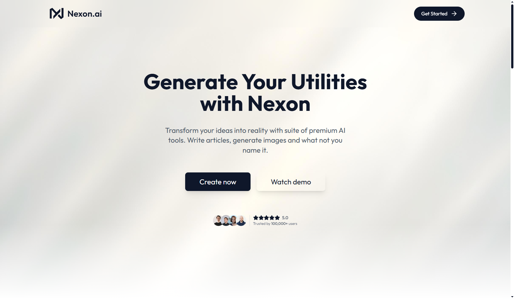
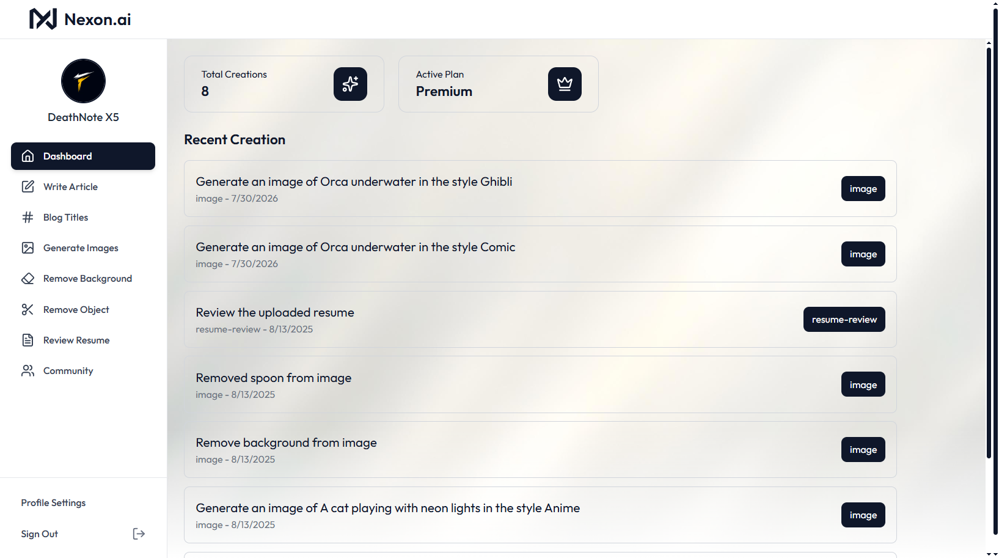
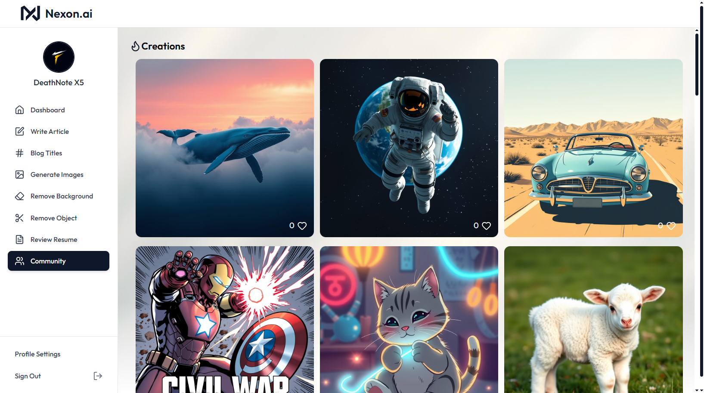

# ⚡ Nexon.ai — AI-Powered Content & Utility Suite

<div align="center">


**A full-stack AI SaaS platform for content generation, image editing, and career tools**

[](https://reactjs.org/)
[](https://nodejs.org/)
[](https://clerk.com/)
[](https://neon.tech/)
[](LICENSE)

**🔗 Live Application:** [nexonai-beryl.vercel.app](https://nexonai-beryl.vercel.app/)

</div>

---

## 📖 About

Nexon.ai is a full-stack AI-powered SaaS application that brings together content generation, image editing, and career tools in a single platform. Built with a React frontend and an Express backend, it integrates Google's Gemini models (via an OpenAI-compatible API), Cloudinary's AI-driven image transformations, and a usage-based free/premium plan system powered by Clerk.

---

## ✨ Features

### 📝 AI Content Generation
- **Article Generator** — Generate long-form articles from a prompt with adjustable output length
- **Blog Title Generator** — Generate catchy blog titles instantly from a topic prompt

### 🖼️ AI Image Tools
- **Text-to-Image Generation** — Create AI-generated images from text prompts (via ClipDrop API), automatically stored on Cloudinary
- **Background Removal** — Remove image backgrounds instantly using Cloudinary's AI background-removal transformation
- **Object Removal** — Remove any named object from an image using generative fill/removal

### 📄 Resume Review
- Upload a PDF resume (up to 5MB) and receive AI-generated, constructive feedback on strengths, weaknesses, and areas for improvement

### 🌐 Community Feed
- Browse publicly published AI creations from other users
- Like/unlike community creations in real time

### 🔐 Accounts & Plans
- Secure authentication and session management via Clerk
- Free tier with usage limits (10 free generations) and a Premium tier for unlimited/advanced features (image generation, background/object removal, and resume review are Premium-only)
- Personal creation history stored per user

---

<!-- ## 📸 Screenshots

### Landing Page


### Dashboard


### Write Article


### Generate Images


### Remove Background / Object


### Resume Review


### Community Feed


--- -->

## 🛠️ Tech Stack

**Frontend:** React 19, Vite, Tailwind CSS, React Router, React Markdown, React Hot Toast, Lucide Icons  
**Backend:** Node.js, Express 5, Multer (file uploads), Axios  
**Auth:** Clerk (`@clerk/express`, `@clerk/clerk-react`)  
**AI/ML:** Google Gemini (via OpenAI-compatible endpoint), ClipDrop (text-to-image)  
**Database:** Neon Serverless Postgres  
**Media Storage:** Cloudinary (image hosting + AI transformations)  
**File Processing:** pdf-parse (resume text extraction)

---

## 📦 Installation

### Prerequisites
- Node.js 18+
- npm
- Git
- Clerk account (auth keys)
- Neon Postgres database
- Cloudinary account
- Gemini API key
- ClipDrop API key

### Backend Setup

```bash
# Clone repository
git clone https://github.com/mdalbakiakon/Nexon.ai.git
cd Nexon.ai/server

# Install dependencies
npm install

# Create a .env file with the following:
# DATABASE_URL=
# CLERK_SECRET_KEY=
# CLERK_PUBLISHABLE_KEY=
# CLOUDINARY_CLOUD_NAME=
# CLOUDINARY_API_KEY=
# CLOUDINARY_API_SECRET=
# GEMINI_API_KEY=
# CLIPDROP_API_KEY=

# Start server
npm start
```

Server runs at: `http://localhost:3000`

### Frontend Setup

```bash
# Navigate to client
cd Nexon.ai/client

# Install dependencies
npm install

# Create a .env file with:
# VITE_CLERK_PUBLISHABLE_KEY=
# VITE_BASE_URL=http://localhost:3000

# Start development server
npm run dev
```

Frontend runs at: `http://localhost:5173`

---

## 🔌 API Overview

| Endpoint | Method | Description | Access |
|---|---|---|---|
| `/api/ai/generate-article` | POST | Generate an article from a prompt | Free / Premium |
| `/api/ai/generate-blog-title` | POST | Generate a blog title from a prompt | Free / Premium |
| `/api/ai/generate-image` | POST | Generate an image from a text prompt | Premium |
| `/api/ai/remove-image-background` | POST | Remove background from an uploaded image | Premium |
| `/api/ai/remove-image-object` | POST | Remove a named object from an uploaded image | Premium |
| `/api/ai/resume-review` | POST | Get AI feedback on an uploaded PDF resume | Premium |
| `/api/user/get-user-creations` | GET | Fetch the logged-in user's creation history | Authenticated |
| `/api/user/get-published-creations` | GET | Fetch all publicly published creations | Authenticated |
| `/api/user/toggle-like-creation` | POST | Like/unlike a community creation | Authenticated |

---

## 🤝 Contributing

Contributions are welcome! Please:
1. Fork the repository
2. Create a feature branch
3. Commit your changes
4. Push and open a Pull Request

---

## 👨 Author

**Md. Al Baki Akon**  
GitHub: [mdalbakiakon](https://github.com/mdalbakiakon)  
LinkedIn: [mdalbakiakon](https://www.linkedin.com/in/md-al-baki-akon-352989362/)

---

<div align="center">

**Developed by Md. Al Baki Akon**
⭐ Star this repo if you find it helpful!

</div>
